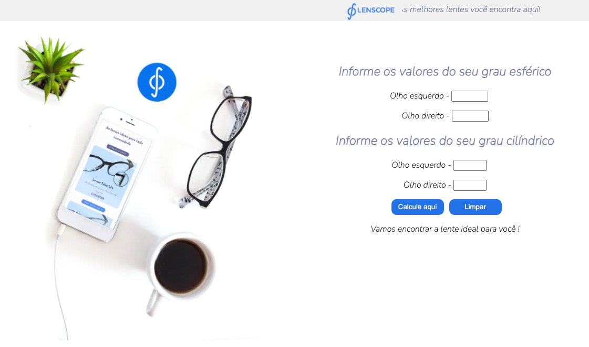

# project-lenscope
## Project for internship vacancy at lenscop company

# I will inform below the characteristics requested by the recruiter to create the page.

Em uma compra online, o usuário insere informações de sua receita oftálmica, e nosso sistema deve exibir uma lente que atende a sua necessidade.
Precisamos captar 4 parâmetros numéricos do usuário. São eles: grau esférico do olho esquerdo, grau esférico do olho direito, grau cilíndrico do olho 
esquerdo e grau cilíndrico do olho direito. A lente Prime só pode ser uma opção para o usuário que tiver grau esférico, seja do olho esquerdo ou do olho
direito, entre -3 e -12. Além disso, ela só atende até grau cilíndrico -2, porém, se o usuário apresentar grau cilíndrico, ela passa a atender grau esférico
entre -3 e -10. Já a lente Vision é uma opção para quem tem de 0 a -15 de esférico e até -5 de cilíndrico. OBS: O grau limite que usuário pode inserir é de 0
a -15 para esférico e -6 para cilíndrico e são números iterados de 0.25 em 0.25 (ex: -0.25; 0; +0.25; etc). Crie uma solução que realize estes cálculos e
retorne o resultado para o cliente.

    
### *Hosted the site on netlify*

[click here to open the website](https://lenscope-project.netlify.app) :rocket:

